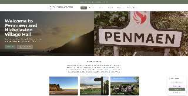

# Penmaen and Nicholaston Village Hall



This is the public-facing website and administrative portal for **Penmaen and Nicholaston Village Hall**, located on the beautiful Gower Peninsula (serving Tor Bay and 3 Cliffs). It acts as a community hub providing information about local events, hall bookings, churches, local businesses, and community news.

## 🎯 Who is this for?
- **Local Residents & Visitors**: A central place to find out about coffee mornings, art classes, choir rehearsals, and other community events.
- **Village Hall Committee**: An easy-to-use platform to manage hall bookings, publish news articles, and keep the community informed.

## 📄 Pages & Features

### Public Pages

---

#### `/` — Home
The main landing page and community hub entry point.
- Full-width hero image with overlay text and a welcome message.
- "About Our Community" section with three image tiles showcasing Tor Bay, Three Cliffs Bay, and local events.
- Four quick-link cards directing visitors to **Book the Hall**, **Blog**, **Churches**, and **Committee**.
- Coffee Morning highlight card linking to the coffee morning page.
- "Friends of the Hall" newsletter signup — submits to `/api/send-newsletter` and adds the subscriber to the Brevo mailing list.

---

#### `/hall` — Hall Booking
The primary page for enquiring about hall hire.
- Hero section with hall entrance image, floor plan, and four info cards (opening hours, hire rates — £40/session or £120/day, parking £10, capacity 80).
- **Booking calendar** showing which dates are already confirmed (fetched live from the Supabase `bookings` table), so visitors can see availability at a glance.
- **Booking enquiry form** with date-range picker, session type selection (Morning / Afternoon / Evening / Full Day), and details field. Submitting sends an email to the hall admin and a confirmation to the visitor via `/api/send-booking`, and inserts a `pending` record into the database.
- Regular weekly activities listed (Coffee Morning, Art Class, Choir).
- "Friends of the Hall" email signup modal.

---

#### `/hall/events` — Events
Community events calendar and regular activities schedule.
- **Upcoming events grid**: each card shows a date box, title, description, time, and location. Data is fetched live from the Supabase `events` table.
- **Regular activities grid**: recurring sessions (Coffee Morning, Art Classes, Choir Rehearsals) displayed with colour-coded themes, icons, and schedules, fetched from the `regular_activities` table.
- **Admin controls** (role: `blog`): plus/edit/delete buttons appear inline for logged-in admins to create, modify, or remove events and activities without leaving the page.

---

#### `/hall/coffee-morning` — Coffee Morning
Dedicated page for the monthly village coffee morning.
- **Countdown timer** that dynamically calculates the number of days until the next first Saturday of the month at 10:30 am.
- Three detail cards: when, time, and who runs it.
- **Paginated recent updates** (3 per page) — article cards with hero images, excerpts, and category badges, fetched from the `coffee_morning_updates` table.
- **Photo gallery** — a responsive grid (mobile carousel, desktop grid) of cake/event photos. Falls back to 8 default Unsplash images if no admin-uploaded photos exist.
- **Admin controls** (role: `coffee_mornings`): drag-and-drop gallery reordering, add/edit/delete gallery images, and a mode toggle to switch between view and manage states.

---

#### `/hall/coffee-morning/:slug` — Coffee Morning Article
Individual coffee morning update article view.
- Full hero image with back-navigation breadcrumb (Home > Coffee Morning > Category).
- Article metadata: publication date, reading time (calculated from word count), draft status badge.
- Structured body rendered from Markdown with a styled excerpt block.
- Fundraising details panel (cause and amount raised, where applicable).
- **Previous / Next** article navigation cards (circular — wraps from last to first).

---

#### `/hall/for-families` — For Families *(placeholder)*
Placeholder page indicating upcoming content for families with an animated loading indicator.

---

#### `/blog` — Blog
Community news and article listing.
- Full-width hero with gradient overlay and a live **search bar**.
- **Category filter buttons**: All, Community, Events, Nature, Heritage.
- **Featured post layout**: the marked `featured` post (or first post) is displayed large with a hero image, title, and excerpt; additional posts appear in a side column.
- Remaining posts displayed in a responsive card grid with hover effects.
- Search and category filters combine to instantly filter the displayed posts.

---

#### `/blog/:slug` — Blog Article
Individual blog post reader.
- Full hero image, breadcrumb, category badge, and metadata (date, read time, draft status).
- Styled excerpt block with a left border.
- Body content rendered from Markdown, split into paragraphs.
- **Previous / Next** article navigation (circular) at the bottom of the page.

---

#### `/churches` — Churches
Information about the two local churches.
- Hero section with "Our Churches" heading.
- Two **ChurchCard** components — St. John's Penmaen and St. Nicholas Nicholaston — each displaying service times, contact details, and a photo, fetched dynamically from the `churches` table.
- "Join Friends of the Churches" modal with name and email fields; submission calls `/api/send-newsletter` with `group="churches"` and adds the subscriber to the dedicated Brevo list.
- Community Worship notice card.

---

#### `/committee` — Committee
Village hall governance and trustee information.
- Hero and introductory description of the committee's purpose.
- **Registered Charity card** with charity number 1081661 and a direct link to the UK Charity Register.
- Ilston Community Council card with external link.
- **Dynamic trustee member cards** — names and roles fetched live from the `committee_members` table.
- Quarterly meetings and AGM information section.
- "Get Involved" call-to-action linking to the contact page.

---

#### `/businesses` — Local Businesses
Directory of local businesses near the hall.
- Google Maps embed (loads on click to avoid third-party cookie issues on page load).
- **Seven business categories**, each with image cards, description, and "Visit Website" links that open in a new tab:
  - Campsites (3), Accommodation (2), Shops (1), Restaurants (3), Attractions (4), Outdoor Activities (2), Castles (2).
- All business data is hardcoded with locally hosted images.

---

#### `/contact` — Contact
Hall contact details and directions.
- **What3Words map widget** initialised on load (location code: `listed.wisdom.dividers`).
- Three info cards: address, email, and operating hours.
- "Find Us" section with a What3Words badge and three navigation buttons (Google Maps, Apple Maps, Waze) that deep-link to the hall's GPS coordinates (51.575396, −4.129141).
- Supporting local business notice.

---

### Admin System

The admin system is entirely role-based. All admin pages are protected by React route guards and inaccessible to unauthenticated or unpermissioned users.

---

#### `/admin/login` — Admin Login
Multi-step authentication flow for committee members.
- **Step 1:** Select your user account from a dropdown list (fetched from `admin_users`).
- **Step 2:** Enter your password with a visibility toggle and "Remember me" checkbox.
- **Set password step:** Triggered automatically when a Supabase invite or recovery link is detected in the URL — allows a new admin to set their password on first login.
- Manual email/password fallback for edge cases.
- Clear error messages for invalid credentials, rate limiting, and network failures.

---

#### `/admin/blog` — Blog CMS
*Requires role: `blog`*
- Table of all blog posts with columns: title, category, status (Published / Draft), publish date, and actions.
- **Search bar** and **status filter** (All / Published / Draft) to quickly find posts.
- Create or edit a post in a rich form: title, slug, category, excerpt, Markdown body, hero image upload (stored in the `blog-images` Supabase storage bucket), featured toggle, and published toggle.
- **Delete** with a confirmation prompt.

---

#### `/admin/bookings` — Booking Management
*Requires role: `bookings`*
- Table of all hall booking enquiries: date range, name, email, session type, and current status.
- Colour-coded **status badges**: Pending (yellow), Confirmed (green), Declined (red).
- Admins can update the status of any booking via an inline dropdown — the change is saved to the `bookings` table immediately.
- Confirmed bookings are reflected on the public Hall page calendar in real time.

---

#### `/admin/committee` — Committee Members
*Requires role: `committee`*
- Table of all trustee records with name, role title, and display order.
- **Add** a new member via a slide-in form with name, role, and display order fields.
- **Edit** an existing member's details in the same form.
- **Delete** with a confirmation modal to prevent accidental removal.

---

#### `/admin/coffee-morning` — Coffee Morning CMS
*Requires role: `coffee_mornings`*
- List of all coffee morning update articles with title, publish date, and status.
- Create or edit an update: title, slug, excerpt, Markdown body, hero image upload (stored in the `coffee-morning-gallery` Supabase storage bucket), event date, fundraising details, and published toggle.
- **Gallery management**: upload, label, and delete gallery images; drag-and-drop to reorder display order; toggle between normal and large grid sizes.
- **Delete** with a confirmation prompt.

---

#### `/admin/users` — User Management
*Requires role: Master Admin only*
- Table of all admin users: email, display name, assigned roles, and a Master Admin badge where applicable.
- **Edit Roles modal**: a checklist of available roles (`blog`, `bookings`, `committee`, `coffee_mornings`) to assign or revoke. Master Admins are shown with all roles and cannot be demoted through this UI.
- **Remove User**: removes the record from `admin_users`, revoking all admin access (the Supabase auth account itself must be deleted separately via the Supabase dashboard).
- New admins are invited via the Supabase dashboard; they receive a magic-link email and set their password on first login.

---

#### Admin Toolbar
A floating toolbar visible to all logged-in admins on every page showing their initials/avatar, current roles, quick links to admin sections, and a logout button.

---

### Role Summary

| Role | Grants Access To |
|---|---|
| `blog` | Admin Blog CMS, Events management |
| `bookings` | Admin Bookings dashboard |
| `committee` | Admin Committee member management |
| `coffee_mornings` | Admin Coffee Morning CMS and gallery |
| Master Admin | All of the above + Admin Users (user management) |

---

### API Routes

#### `POST /api/send-booking`
Handles hall booking enquiries submitted from the `/hall` page.
- Validates required fields: `name`, `email`, `date`, `details`. Returns `400` for missing fields, `405` for non-POST requests.
- Sends an email to the hall admin with full booking details.
- Sends a confirmation email to the visitor.
- Inserts a `pending` booking record into the Supabase `bookings` table.

#### `POST /api/send-newsletter`
Handles newsletter / Friends sign-ups from the Hall and Churches pages.
- Validates that `email` is present.
- Sends an admin notification email and a welcome confirmation to the subscriber.
- Adds the subscriber to the appropriate Brevo mailing list based on the `group` field (`hall` or `churches`).

---

## ✨ Feature Summary
- **Responsive public pages** covering hall hire, events, blog, churches, committee, and local businesses.
- **Live booking calendar** showing confirmed hire dates to the public.
- **Email-integrated booking and newsletter forms** using Brevo (Sendinblue) SMTP.
- **Role-based admin CMS** for blog, coffee mornings, bookings, committee, and events — all manageable from within the website.
- **Invite-based admin onboarding** using Supabase Auth magic links.
- **Master Admin user management** to grant and revoke admin roles.
- **Supabase image storage** for blog hero images, coffee morning gallery, and church photos.
- **Markdown rendering** for blog and coffee morning articles.

## 🛠️ Technologies Used
- **Frontend Framework**: [React 18](https://react.dev/) with [TypeScript](https://www.typescriptlang.org/)
- **Build Tool**: [Vite](https://vitejs.dev/)
- **Styling**: [Tailwind CSS](https://tailwindcss.com/) for structured utility-first styling.
- **Routing**: [React Router v6](https://reactrouter.com/)
- **Backend & Database**: [Supabase](https://supabase.com/) 
  - **Auth**: Email & Password authentication with Master Admin Invite system.
  - **PostgreSQL Database**: Core database storing blog posts and administrator allowlists.
  - **Row Level Security (RLS)**: Securing data mutations and reads at the database level.
- **Icons**: [Lucide React](https://lucide.dev/)
- **Forms**: [Web3Forms](https://web3forms.com/) handling form submissions securely without a custom backend.

## 🚀 Getting Started

### Prerequisites
Make sure you have Node.js and a package manager (like `npm` or `yarn`) installed.

### Installation
1. Install the dependencies:
   ```bash
   npm install
   ```
2. Set up the environment variables. The `.env` file should have the following defined:
   ```env
   VITE_SUPABASE_URL="..."
   VITE_SUPABASE_ANON_KEY="..."
   VITE_SUPABASE_SERVICE_ROLE_KEY="..." 
   VITE_WEB3FORMS_KEY="..."
   VITE_MASTER_ADMIN_EMAILS="owenjames97@outlook.com"
   ```
3. Start the development server:
   ```bash
   npm run dev
   ```

## 🧪 Testing

The test suite uses **[Vitest](https://vitest.dev/)** and **[React Testing Library](https://testing-library.com/)**. All 34 tests run in under 3 seconds with no external dependencies.

### Run the tests

```bash
npm test          # run once and exit (CI-friendly)
npm run test:watch  # watch mode — re-runs on file save
```

### What is covered

| Test file | Tests | What is verified |
|---|---|---|
| `src/__tests__/escapeHtml.test.ts` | 7 | User-supplied strings are HTML-escaped before being inserted into email bodies, preventing HTML injection. |
| `src/__tests__/auth.logic.test.ts` | 11 | Master-admin email lookup (`isMasterAdminEmail`) handles case-sensitivity, whitespace, null, undefined, and empty env vars. Role gating (`hasRole`) lets master admins bypass all role checks and correctly gates regular admin users. |
| `src/__tests__/AdminRoute.test.tsx` | 5 | Unauthenticated users redirect to `/admin/login`. Users with the wrong role see "Access Denied". Users with the correct role see the protected page. A loading skeleton is shown while auth resolves. |
| `src/__tests__/MasterAdminRoute.test.tsx` | 3 | Only master admins reach `/admin/users`; all others redirect to `/admin/login`. Loading skeleton is shown during auth resolution. |
| `src/__tests__/send-booking.test.js` | 6 | Non-POST requests return `405`. Missing `name`, `email`, `date`, or `details` each return `400 { error: "Missing required fields" }`. |
| `src/__tests__/send-newsletter.test.js` | 2 | Non-POST requests return `405`. A request without `email` returns `400 { error: "Email is required" }`. |

> **Note on email delivery:** The email-sending path in the API handlers uses the [Nodemailer](https://nodemailer.com/) CJS module, which cannot be mocked in vitest unit tests without refactoring the production code. Email delivery should be verified end-to-end by submitting the live booking or newsletter form on the deployed site and confirming receipt.

## 🎨 Original Design
The original design concepts for the project can be found on [Figma](https://www.figma.com/design/nFqAeB7GiD6K3kmQlD6KMj/gower-village-hall).
